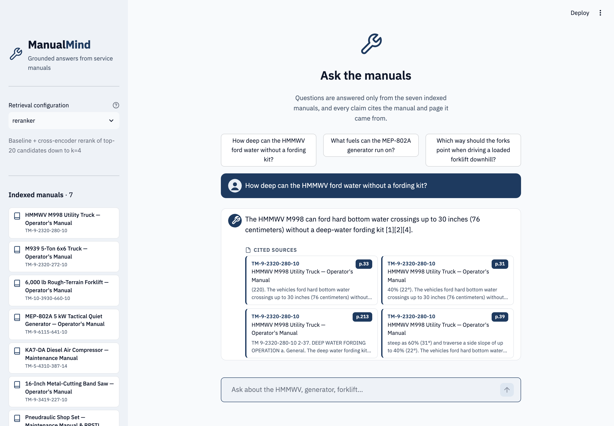

# ManualMind — RAG over Equipment Service Manuals, Measured with Ragas

A chatbot that answers equipment questions **only** from seven public-domain U.S. Army
service manuals (HMMWV, 5-ton truck, forklift, generator, air compressor, band saw,
pneudraulic shop), cites the **manual and page** for every claim, and backs every
retrieval design choice with **measured Ragas metrics** — including a before/after
study that changes one variable at a time.

> Personal learning/portfolio project. All manuals are public-domain works of the
> U.S. Federal Government (17 U.S.C. § 105) — see [data/SOURCES.md](data/SOURCES.md).



## What it does

- **Grounded chat** — Claude (haiku-4.5) answers strictly from retrieved manual
  excerpts; each factual claim carries an inline `[n]` citation that maps to a
  source card (manual title + page). Off-corpus questions get an honest refusal.
- **Config-driven retrieval** — four single-variable configurations selectable
  live in the UI sidebar:

  | Config | The one change |
  |---|---|
  | `baseline` | dense-only, chunk 800/150, k=4 |
  | `small-chunks` | chunk 300/100 (the forked repo's original setting) |
  | `reranker` | + cross-encoder rerank of top-20 → k=4 |
  | `hybrid` | BM25 + dense with reciprocal rank fusion |

- **Measured, not asserted** — a 32-question eval set with ground truths taken
  from the manuals' own pages, scored with Ragas on faithfulness, answer
  relevancy, context precision, and context recall.

## Results (before/after config study)

All four configs, one Ragas run each over the same 32 questions (generation:
claude-haiku-4-5; judge: claude-sonnet-5; deltas vs baseline in parentheses).
Source of truth: `evals/results/*_summary.json` + `comparison.xlsx`, 2026-07-08.

| Config | faithfulness | answer_relevancy | context_precision | context_recall |
|---|---|---|---|---|
| baseline | 0.953 | 0.503 | 0.364 | 0.469 |
| small-chunks | 0.919 (−0.034) | 0.378 (−0.124) | 0.340 (−0.023) | 0.312 (−0.156) |
| reranker | 0.961 (+0.008) | 0.676 (+0.174) | 0.572 (+0.208) | 0.656 (+0.187) |
| hybrid | 0.976 (+0.023) | 0.537 (+0.035) | 0.405 (+0.042) | 0.500 (+0.031) |

**What the numbers say (faithfulness and recall read together):**

- **Baseline is honest but incomplete** — 0.953 faithfulness with only 0.469
  recall: when retrieval misses, the bot refuses rather than invents, so recall
  (and relevancy, which punishes refusals) is where the headroom lives.
- **The reranker is the clear win**: +0.21 context precision and +0.19 recall —
  fetching 20 candidates and letting a cross-encoder pick 4 fixes most retrieval
  misses, which cascades into +0.17 answer relevancy (fewer refusals) while
  keeping faithfulness at 0.961. It's the default config in the app.
- **The fork's original 300-char chunking measurably hurts**: −0.16 recall vs
  800-char chunks. Spec tables get shredded below the size of one coherent fact
  cluster — the eval turned "chunk size matters" from folklore into a number.
- **Hybrid BM25+dense helps modestly** (+0.03 recall, best-in-study 0.976
  faithfulness) but doesn't reach the reranker; on this corpus, exact-term
  matching adds less than candidate re-scoring. (One variable at a time, so
  reranker+hybrid is untested — the obvious next experiment.)

**Two bugs the eval caught before any number was trusted** (both "before" runs
are archived in `evals/results/archive-*/` with explanations):

1. **Corpus extraction** — pypdf emitted kerning-broken text ("`15 0
   horsepower`", "`p s i`") on spec tables. Answers looked right, but the judge
   correctly scored them unsupported by the corrupted context (baseline
   faithfulness 0.594). Switching extraction to PyMuPDF fixed the text layer.
2. **Eval harness** — `retrieved_contexts` initially lacked the `(manual, page)`
   headers the generator sees, so the judge rejected any claim naming the
   vehicle ("no mention of HMMWV in the context"): faithfulness 0.0 with recall
   1.0 on correct answers. Contexts now match what the generator saw
   (verified on the failing sample: 0.0 → 1.0).

## Architecture

```
data/pdfs (7 TMs, 1,939 pages)
  └─ src/ingest.py    pypdf page-wise extract → per-page chunks (citations never
                      cross pages) → BAAI/bge-small-en-v1.5 (local) → FAISS
  └─ src/rag.py       retrieve (dense | +reranker | hybrid RRF) → Claude answers
                      with forced inline [n] citations
  └─ evals/           questions.csv (32 q) → run_ragas.py (judge: sonnet-5)
                      → results/*.json|csv → compare.py → comparison.xlsx/md
  └─ app.py           Streamlit chat UI (streaming, source cards, config picker)
```

**Model split:** generation is `claude-haiku-4-5` (fast, cheap), the Ragas judge is
`claude-sonnet-5` (stronger, and a different model avoids self-preference bias).
Embeddings are local (no embedding API cost; deployable on a CPU-only Space).

## Run it

```bash
git clone https://github.com/tsh52110/manual-mind && cd manual-mind
uv venv --python 3.11 .venv && uv pip install -r requirements.txt
echo "ANTHROPIC_API_KEY=sk-ant-..." > .env

# indexes are committed; rebuild if you change chunking
.venv/bin/python -m src.ingest

.venv/bin/streamlit run app.py
```

Evaluate a config and rebuild the comparison table:

```bash
.venv/bin/python -m evals.run_ragas --config reranker
.venv/bin/python -m evals.compare
```

## Eval methodology

- 32 questions across all seven manuals (`evals/questions.csv`); each
  `ground_truth` was written from the manual's own text, page-verified.
- One Ragas run per config; per-question scores and aggregates are saved in
  `evals/results/` — every number in the table above comes from a saved run
  (no hand-entered metrics).
- **Read faithfulness and context recall together**: faithfulness measures
  whether the answer sticks to the retrieved excerpts; recall measures whether
  the right excerpts were retrieved at all. A config can be "honest but
  incomplete" (high faithfulness, low recall) — which is exactly the trade-off
  the study surfaces.
- CI: `.github/workflows/eval-gate.yml` runs a fixed 10-question subset on
  manual dispatch (and PRs touching `src/`) and fails below a 0.85
  faithfulness floor. Manual dispatch because judge calls cost real money.

## Fork provenance & fixes

Forked from [RitikaVerma7/Chatbot-RAG_with_Evaluation](https://github.com/RitikaVerma7/Chatbot-RAG_with_Evaluation)
(FAISS + LangChain + Ragas + Streamlit over an insurance policy PDF). Kept: the
overall pipeline shape (PDF → chunk → FAISS → retrieve → answer → Ragas) and its
chunk 300/100 setting as the `small-chunks` study arm. Fixed/replaced along the way:

- **Stale pins** (LangChain 0.2.x, Ragas 0.1.9) → current LangChain 1.x / Ragas 0.4.
- **Ragas legacy import crash** — Ragas ≤0.4.3 imports `ChatVertexAI` from a module
  removed in langchain-community 1.x; shimmed in `evals/run_ragas.py`.
- **Claude 5 judge rejects `temperature`** — Ragas injects it per call; fixed with
  the wrapper's `bypass_temperature`.
- **Re-embedding the whole corpus on every chat message** (original `app.py`) →
  indexes built once by `src/ingest.py`, loaded and cached at startup.
- **String-level citation** ("Source: Policy document") → real per-chunk metadata
  citations (manual + page), enforced by the prompt and rendered as source cards.
- OpenAI-only → Anthropic + local embeddings (no OpenAI key required anywhere).
- The original notebooks and Streamlit app remain in `Code/` and `Streamlit/`,
  with the upstream README preserved at `docs/UPSTREAM_README.md`.

## Data sources & licenses

Seven U.S. Army Technical Manuals, all public domain as U.S. Government works
(17 U.S.C. § 105), downloaded from liberatedmanuals.com. Full table with TM
numbers, page counts, and verification notes: [data/SOURCES.md](data/SOURCES.md).

## Deploy

The app is self-contained (committed indexes + local embeddings): point
Streamlit Community Cloud or a Hugging Face Space (Streamlit SDK) at this repo,
set the `ANTHROPIC_API_KEY` secret, done.

- **Streamlit Community Cloud**: share.streamlit.io → New app → this repo,
  `app.py` → add `ANTHROPIC_API_KEY` under Secrets.
- **HF Space**: create a Streamlit-SDK Space, push this repo to it, add
  `ANTHROPIC_API_KEY` as a Space secret.
